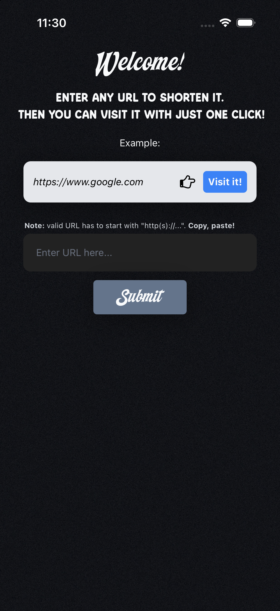
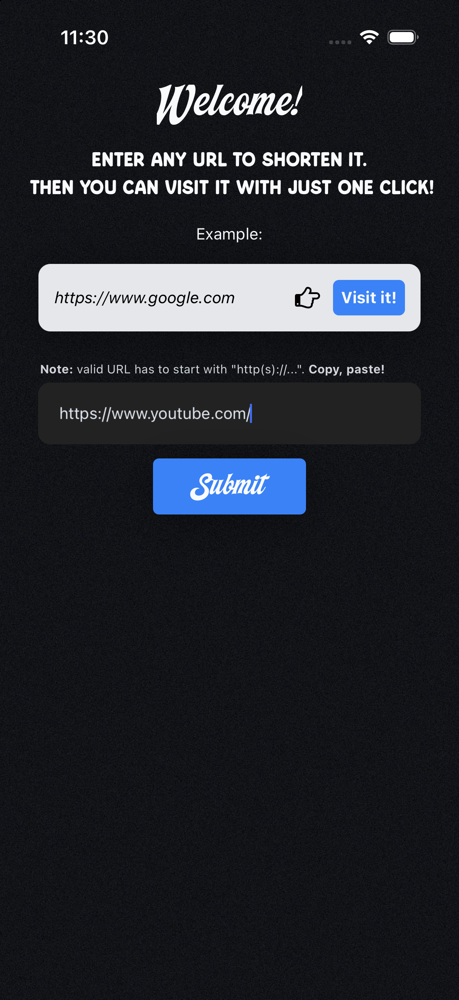
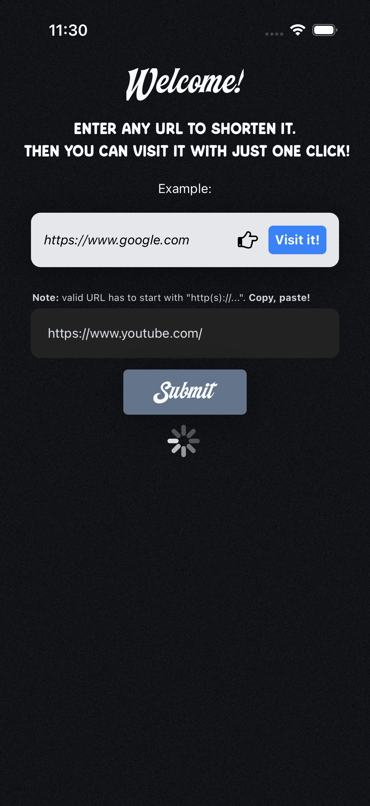
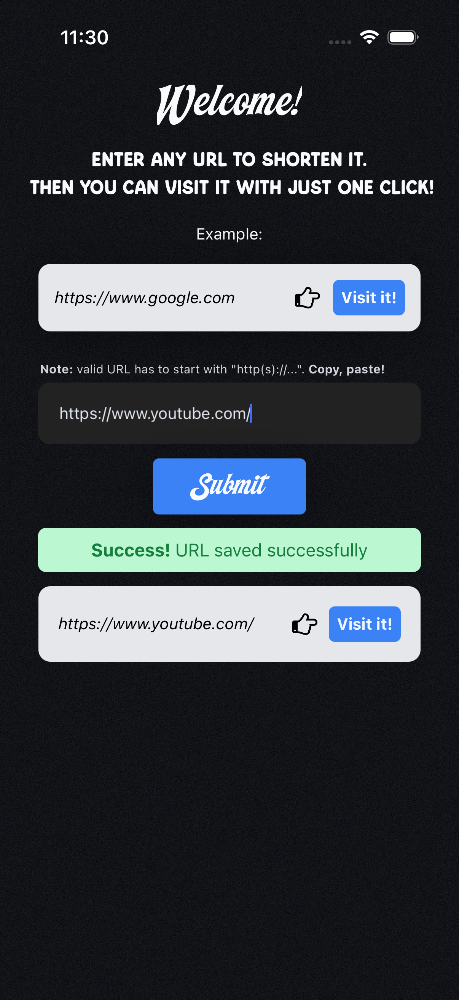
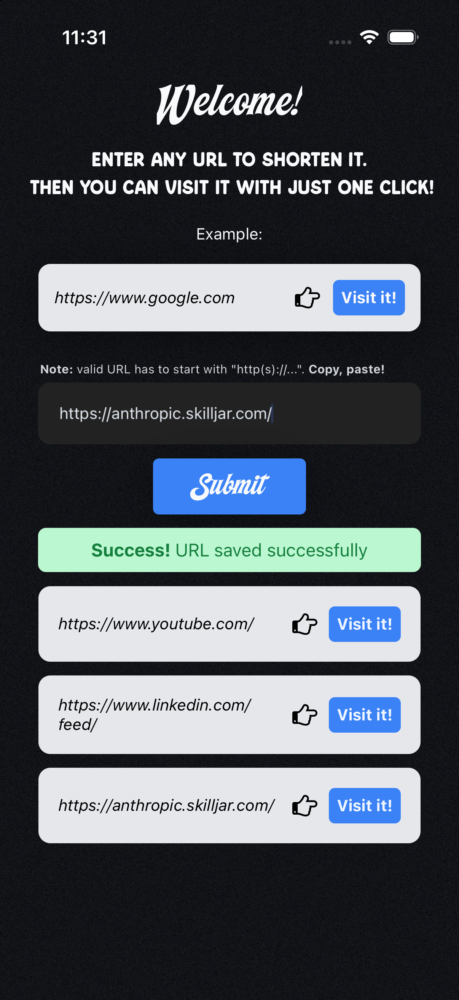

# React Native URL Shortener

A mobile app (iOS/Android, plus web via Expo) that shortens URLs. It's a client for my own [URL Shortener Microservice backend](https://github.com/luchob89/fcc-URL-Shortener-Microservice), originally a freeCodeCamp Back End project.

## Screenshots

| Home | Enter a URL | Shortening... | Shortened | Multiple shortened URLs |
| --- | --- | --- | --- | --- |
|  |  |  |  |  |

## Features

- Enter any URL and shorten it through the backend API.
- Client-side validation: the URL must start with `http`.
- Loading, success, and error states while the request is in flight.
- A running list of the URLs shortened during the session, each with a "Visit it!" button that opens the short link directly.
- Custom fonts and a splash screen configured with `expo-font` and `expo-splash-screen`.

## Tech Stack

- [Expo](https://expo.dev) (SDK 57) with [Expo Router](https://docs.expo.dev/router/introduction/) for file-based routing
- React Native 0.86 + React 19, TypeScript
- [NativeWind](https://www.nativewind.dev/) (Tailwind CSS for React Native) for styling
- `expo-linking` to open short URLs, `expo-font` for custom fonts

## Project Structure

```
app/
  _layout.tsx   # Root layout: loads custom fonts, controls the splash screen, sets up the Stack navigator
  index.tsx     # Main (and only) screen: input, API call, and results list
assets/
  fonts/        # Custom fonts used on the main screen
  images/       # App icon, splash image, and background
```

## How to Run

1. Install dependencies:

   ```bash
   npm install
   ```

2. Start the Expo dev server:

   ```bash
   npx expo start
   ```

3. From the Expo CLI output, open the app in an iOS simulator, an Android emulator, Expo Go, or a web browser.

The app talks to a hardcoded production backend URL (see `API_URL` in `app/index.tsx`), so no environment configuration is needed to try it out.

## Backend

This app consumes [fcc-URL-Shortener-Microservice](https://github.com/luchob89/fcc-URL-Shortener-Microservice), a Node.js URL-shortener API I also built.
